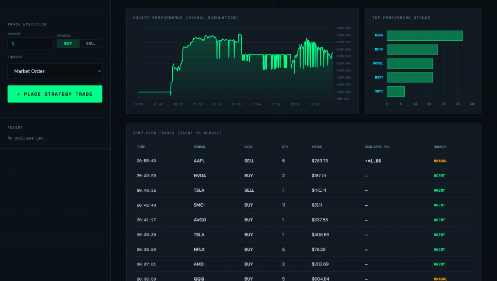

<div align="center">

#  FinSight AI Trading Agent

### *An Autonomous, LLM-Powered Trading Platform with Real-Time Market Intelligence*

[](https://python.org)
[](https://fastapi.tiangolo.com)
[](https://ollama.com)
[](https://alpaca.markets)
[](https://docker.com)
[](https://creativecommons.org/licenses/by-nc/4.0/)

</div>

---

## 📸 Dashboard Preview

| 🔍 AI Reasoning & Analysis | 💼 Portfolio & Risk Metrics |
|:---:|:---:|
|  |  |
| **🛡️ Market Status Indicator** | **📈 Equity Performance (Zoom)** |
|  |  |

---

## 🧭 About

**FinSight** is a full-stack, autonomous AI trading agent that bridges the gap between complex financial data and actionable trading decisions. It leverages **local Large Language Models** (via Ollama) to analyze real-time market data, generate intelligent `BUY`, `SELL`, or `HOLD` signals, and autonomously execute trades — all from a sleek, dark-mode dashboard.

**Safety First**: Since the latest update, FinSight is now **Market Aware**, automatically pausing trading execution for stocks when the market is closed to protect against low liquidity and opening gaps.

---

## 🧠 The Brain: AI-Driven Synthesis Algorithm

FinSight doesn't rely on hardcoded "if-then" rules. Instead, it uses a multi-layered **Synthesis Algorithm** to make decisions:

### 1. Data Acquisition (The "Eyes")
Every cycle, the agent gathers a full context of the stock:
- **Price Action**: Tick-by-tick monitoring of current price, volatility, and **real-time volume**.
- **Technical Indicators**: RSI(14), MACD, and multiple Moving Averages (SMA/EMA).
- **Sentiment Feed**: Real-time fetching of the latest news headlines for the specific ticker.

### 2. Intelligent Analysis (The "Brain")
The system feeds this data to a local LLM (via Ollama) which acts as a seasoned technical analyst:
- **Holistic Evaluation**: It weighs technicals against news. (e.g., *RSI might be oversold, but if news is bearish, the AI may HOLD instead of BUY*).
- **Risk Scoring**: Generates a **Risk Score (1-10)** based on current market conditions and volatility.
- **Support Discovery**: Identifies key historical support levels to suggest a **Stop-Loss**.

### 3. Execution & Safety (The "Shield")
- **Dynamic Sizing**: Uses the Risk Score to calculate position size. Low-risk setups get larger capital allocation.
- **Persistent Protection**: The agent monitors positions 24/7 and executes defensive exits if the stop-loss is triggered.
- **Market Hours Awareness**: Automatically detects US market hours and pauses execution for equity assets during off-hours, while remaining active for 24/7 markets like Crypto.

---

## ✨ Features

<details>
<summary><b>🧠 AI-Driven Market Analysis</b></summary>

- **Local LLM Integration**: Powered by [Ollama](https://ollama.com), supporting models like `llama3.1`, `mistral`, `gemma`, and more — all running **100% locally** with no data sent to external AI APIs.
- **Intelligent Signal Generation**: The AI synthesizes technical indicators, price history, and live news to produce clear `BUY`, `SELL`, or `HOLD` signals with detailed reasoning.
- **News Sentiment Analysis**: Fetches and incorporates the latest financial news for each ticker into the analysis context.
- **Risk Assessment**: The AI now generates a **Risk Score (1-10)** and a **Suggested Stop-Loss** for every trade, ensuring defensive positioning.
- **Volume Awareness**: Real-time trading volume is now incorporated into the analysis and displayed on the dashboard.
- **Structured Reasoning**: Every decision comes with a human-readable explanation of *why* the signal was generated.

### 🔄 Choose Your Analysis Model

Select the LLM that powers your analysis directly from the dashboard — no restart needed:

| Model | Type | Best For |
|---|---|---|
| `llama3.1` *(Recommended)* | Local (Ollama) | Best balance of speed and accuracy for financial analysis |
| `llama3` | Local (Ollama) | Faster inference, great for frequent monitoring cycles |
| `phi3` *(Lightweight)* | Local (Ollama) | Low-resource machines, quick signal generation |
| `tinyllama` *(Ultra-Light)* | Local (Ollama) | Minimal RAM usage, fastest response times |
| `gpt-4o` | Cloud (OpenAI) | Highest accuracy, requires OpenAI API key |
| `gemini-2.0-flash` | Cloud (Google) | Fast and capable, requires Gemini API key |

> Switch models on the fly from the **Analyze Ticker** panel — the agent will use the newly selected model from the very next cycle.

</details>

<details>
<summary><b>📊 Interactive Real-Time Dashboard</b></summary>

- **Premium Dark UI**: A glassmorphic, dark-mode interface with vibrant cyan/teal accents built for professional use.
- **Market Status Indicator**: New header badge showing **MARKET OPEN/CLOSED** status based on real-time US exchange hours.
- **3D Globe Visualization**: An interactive, rotating 3D Earth that visualizes company headquarters locations and global market activity.
- **Live Price Charts**: Switchable chart views for **Price History**, **RSI**, and **MACD** with smooth animations.
- **Equity Performance Zoom**: A new **ZOOM** toggle for the equity curve chart that filters out historical outliers to focus on recent P&L fluctuations.
- **Technical Indicator Cards**: At-a-glance cards for RSI(14), MACD Signal, SMA/EMA(20), and Mid-Term SMA(50) with interpretive labels.
- **AI Activity Feed**: A live, scrolling feed of all agent analysis and trade execution notifications.
- **Visual Risk Indicators**: Clear **RISK** and **STOP LOSS** status in the portfolio view with **"ANALYSIS PENDING"** placeholders for new positions.

</details>

<details>
<summary><b>💼 Portfolio & Account Management</b></summary>

- **Dual Portfolio View**: Toggle between **Total Portfolio** (all positions) and **Agent Only** (AI-managed positions) views.
- **Real-Time P&L Tracking**: Live unrealized profit/loss calculation for every open position, updated on every price refresh.
- **Key Metrics Dashboard**: Net Equity, Buying Power, Cash, Net Profit, Net Loss, and Max Drawdown — all in one view.
- **Open Positions Table**: Detailed table showing Symbol, Quantity, Average Entry Price, Current Price, **Stop Loss**, **Risk Score**, P&L ($), and P&L (%) for all holdings.
- **Metadata Persistence**: Stop-loss and risk analysis are now saved locally, ensuring they persist across dashboard refreshes even for Alpaca trades.
- **Order Status Tracking**: Positions now show a **PENDING** label while orders are being filled on Alpaca, providing clear execution feedback.

</details>

<details>
<summary><b>🤖 Autonomous Trading Agent</b></summary>

- **Continuous Monitoring Loop**: The agent runs a configurable monitoring cycle (e.g., every 5 minutes) across a wide 16-ticker watchlist.
- **Portfolio-Wide Coverage**: The agent now automatically monitors **all held positions** in addition to the watchlist, ensuring protective stop-losses are updated for every asset.
- **Autonomous Trade Execution**: When enabled, the agent automatically places orders based on its analysis — no human intervention needed.
- **Market Hours Guard**: Automatically skips trade execution for equity assets when US markets are closed, reducing risk from after-hours volatility.
- **Risk-Aware Sizing**: Trade quantity is dynamically adjusted based on the AI's risk score (Lower risk = larger size).
- **Automated Stop-Loss Protection**: The agent monitors positions and executes a defensive exit if a suggested stop-loss price is breached.
- **API Resilience**: Automatically detect AlphaVantage rate limits and switches to **Local Indicator Fallbacks** (RSI, MACD) to ensure uninterrupted 24/7 screening.
- **Holdings-Aware Selling**: SELL signals correctly liquidate the agent's actual position in that ticker, not a cash-calculated quantity.
- **Configurable via UI**: Enable/disable autonomous mode and set agent capital allocation directly from the dashboard.

### 💰 Agent Capital & Isolated Portfolio

FinSight lets you allocate a **fixed budget** to the AI agent, completely isolated from your main account:

1. **Set a Capital Limit**: Enter a dollar amount (e.g., `$1,000`) in the **Agent Capital** field on the dashboard and click **SET**.
2. **Isolated Sub-Portfolio**: The agent operates within its own sub-portfolio — it can only spend the capital you've allocated to it.
3. **Separate P&L Tracking**: Switch to the **Agent Only** tab in Portfolio & Account to see *only* the agent's positions, P&L, and equity — completely separate from your manual trades.
4. **Real-Time Agent Equity**: The agent's equity, cash balance, and unrealized P&L update live as market prices change.
5. **No Overspending**: If the agent runs out of its allocated capital, it will automatically skip trades rather than dipping into your main account funds.

</details>

<details>
<summary><b>⚡ Hybrid Trading Execution</b></summary>

- **Alpaca Paper Trading**: Connects to [Alpaca Markets](https://alpaca.markets) for realistic paper trading with real market prices and order management.
- **Local Simulation Mode**: A fully self-contained simulation engine that activates automatically when Alpaca keys are absent — no external dependencies needed.
- **Order Management**: View and track pending orders in real-time.
- **Trade History Log**: Every trade (manual or agent-executed) is logged with timestamp, price, quantity, and source.

### 📐 6 Trading Strategies

When placing a manual trade, choose from **6 distinct strategies** — each with its own entry logic:

| # | Strategy | Logic |
|---|---|---|
| 1 | **Market** | Executes immediately at the current market price. No conditions. |
| 2 | **Momentum** | Buys when RSI > 50 AND MACD > 0 (bullish momentum confirmed). Sells when both are bearish. |
| 3 | **Mean Reversion** | Buys when RSI < 35 (oversold). Sells when RSI > 65 (overbought). |
| 4 | **Breakout** | Buys when price is above the Bollinger Band midline (upward breakout). Sells below it. |
| 5 | **AI Optimized** | Runs a full LLM analysis first and only executes if the AI signal matches your intended direction. |
| 6 | **Manual Override** | Bypasses all strategy checks and executes the trade unconditionally. |

> Trades that don't meet the strategy's conditions are **rejected with a reason** — protecting you from bad entries.

</details>

<details>
<summary><b>🔧 Technical Architecture</b></summary>

- **FastAPI Backend**: High-performance async REST API with automatic Swagger documentation at `/docs`.
- **File-Locked State Management**: Uses `fcntl` file locking to prevent race conditions when multiple processes (agent + API) write to the portfolio simultaneously.
- **Real-Time Price Refresh**: Market prices are fetched from `yfinance` on every account info request, keeping P&L always current.
- **Dual Data Sources**: `yfinance` for OHLCV data and `AlphaVantage` for technical indicators, with automatic fallback.
- **Dockerized Deployment**: Single `docker-compose up` command to launch the entire stack.
- **CORS-Enabled**: Ready for frontend integration from any origin.

</details>

---

## 🛠 Tech Stack

| Layer | Technology |
|---|---|
| **Backend** | Python 3.10+, FastAPI, Uvicorn |
| **AI / LLM** | Ollama (llama3.1, mistral, gemma) |
| **Market Data** | yfinance, AlphaVantage API |
| **Trading** | Alpaca Markets API (Paper Trading) |
| **Frontend** | Vanilla HTML/CSS/JS, Three.js (Globe) |
| **Deployment** | Docker, Docker Compose |
| **State** | JSON with fcntl file locking |

---

## 🚀 Quick Start

### Prerequisites
1. [Docker Desktop](https://www.docker.com/products/docker-desktop/) installed and running.
2. [Ollama](https://ollama.com/) installed with at least one model pulled:
   ```bash
   ollama pull llama3.1
   ollama serve
   ```
3. *(Optional)* [AlphaVantage API Key](https://www.alphavantage.co/support/#api-key) — free tier available.
4. *(Optional)* [Alpaca Paper Trading Keys](https://alpaca.markets) — free account required.

### Installation

```bash
# 1. Clone the repository
git clone https://github.com/shreyanshxt/AI-Agent-Driven-Trading-Platform.git
cd AI-Agent-Driven-Trading-Platform

# 2. Configure environment
cp .env.example .env
# Edit .env and add your API keys (optional but recommended)

# 3. Launch with Docker
docker-compose up --build
```

### Without Docker

```bash
# Create and activate virtual environment
python3 -m venv .venv
source .venv/bin/activate  # On Windows: .venv\Scripts\activate

# Install dependencies
pip install -r requirements.txt

# Start the API server
uvicorn app.main:app --reload

# In a separate terminal, start the autonomous agent
python3 start_agent.py
```

### Access the Platform
| Service | URL |
|---|---|
| **Dashboard** | http://localhost:8000 |
| **API Docs (Swagger)** | http://localhost:8000/docs |
| **Health Check** | http://localhost:8000/health |

---

## 📁 Project Structure

```
finsight_agent/
├── app/
│   ├── main.py                  # FastAPI app, all API endpoints
│   └── services/
│       ├── agent_brain.py       # Autonomous agent loop & decision logic
│       ├── trading_service.py   # Alpaca + Simulation trading engine
│       ├── llm_engine.py        # LLM prompt engineering & analysis
│       ├── llm_providers.py     # Ollama / Gemini provider abstraction
│       ├── data_fetcher.py      # yfinance + AlphaVantage data layer
│       ├── tools.py             # Agent tools (news fetching, etc.)
│       └── notifier.py          # Notification service
├── assets/                      # Dashboard screenshots
├── finsight_dashboard.html      # Single-file frontend dashboard
├── start_agent.py               # Entry point for the autonomous agent
├── docker-compose.yml           # Docker orchestration
├── Dockerfile                   # Container definition
├── requirements.txt             # Python dependencies
└── .env.example                 # Environment variable template
```

---

## 🔌 API Reference

| Method | Endpoint | Description |
|---|---|---|
| `GET` | `/` | Serve the dashboard |
| `GET` | `/health` | Health check |
| `GET` | `/account` | Full account info + positions + agent portfolio |
| `POST` | `/analyze` | Run LLM analysis on a ticker |
| `POST` | `/trade` | Execute a manual trade |
| `GET` | `/trades` | Get full trade history |
| `GET` | `/performance` | Get equity curve history |
| `GET` | `/agent/config` | Get agent configuration |
| `POST` | `/agent/config` | Update agent config (model, watchlist, capital) |
| `POST` | `/agent/allocation` | Set agent capital allocation |

---

## ⚙️ Configuration

Edit `agent_config.json` or use the dashboard UI to configure:

```json
{
    "autonomous_enabled": true,
    "model": "llama3",
    "watchlist": [
        "AAPL", "NVDA", "TSLA", "MSFT", "GOOGL", "AMZN", 
        "META", "AMD", "NFLX", "PLTR", "AVGO", "SMCI",
        "BTC-USD", "ETH-USD", "SPY", "QQQ"
    ],
    "agent_capital": 5000.0,
    "interval_minutes": 5
}
```

---

## 🗺 Roadmap

- [ ] WebSocket support for real-time dashboard updates
- [ ] Multi-agent support with different strategies running in parallel
- [ ] Backtesting engine integration
- [ ] Email/SMS notifications for trade alerts
- [ ] Support for options and crypto derivatives
- [x] Risk management rules (stop-loss, take-profit)

---

## 🤝 Contributing

Contributions are welcome! Please feel free to submit a Pull Request.

1. Fork the repository
2. Create your feature branch (`git checkout -b feature/AmazingFeature`)
3. Commit your changes (`git commit -m 'Add some AmazingFeature'`)
4. Push to the branch (`git push origin feature/AmazingFeature`)
5. Open a Pull Request

---

<div align="center">

**Built by [Shreyansh Singh](https://github.com/shreyanshxt)**

⭐ Star this repo if you found it useful!

</div>
